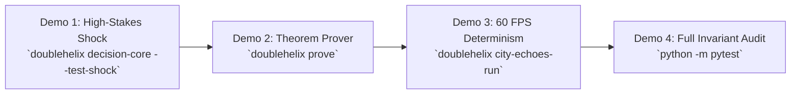

```text
================================================================================
   ____                      _        ____             _     
  / ___|___  ___ _ __ ___   (_) ___  / ___|  ___  _   _| |___ 
 | |   / _ \/ __| '_ ` _ \  | |/ __| \___ \ / _ \| | | | / __|
 | |__| (_) \__ \ | | | | | | | (__   ___) | (_) | |_| | \__ \
  \____\___/|___/_| |_| |_| |_|\___| |____/ \___/ \__,_|_|___/
                       OF SOVEREIGNTY INC.
 
            -- [ NEW-WORLD-ARKITECH.DEV ] --
================================================================================
  TIMESTAMP:  2026-09-23 19:04:45 -05:00
  OWNER:      Cosmic Souls of Sovereignty Inc
  DEVELOPER:  New-World-Arkitech.DEV
  SYSTEM:     Double Helix Neural Agent Engine // SOPHI-Runtime
  DOCUMENT:   Proprietary IP Specification & Live Demonstration Playbook
================================================================================
```

# PROPRIETARY IP SPECIFICATION & LIVE DEMONSTRATION PLAYBOOK
## How to Demonstrate System Superiority, Protect Proprietary Assets, and Credit Open-Source Foundations

**Entity:** Cosmic Souls of Sovereignty Inc.  
**Platform:** New-World-Arkitech.DEV  
**Primary References:**  
- Proprietary Terms: [`LICENSE`](file:///C:/Users/evlga/Desktop/DoubleHelix%20Neural%20Agent%20Engine/LICENSE)
- Technical Monograph: [`docs/TECHNICAL_REPORT_SOPHI_ECOSYSTEM.md`](file:///C:/Users/evlga/Desktop/DoubleHelix%20Neural%20Agent%20Engine/docs/TECHNICAL_REPORT_SOPHI_ECOSYSTEM.md)
- Advancements Whitepaper: [`docs/SOPHI_SYSTEM_ADVANCEMENTS_WHITEPAPER.md`](file:///C:/Users/evlga/Desktop/DoubleHelix%20Neural%20Agent%20Engine/docs/SOPHI_SYSTEM_ADVANCEMENTS_WHITEPAPER.md)

---

# PART I: THE 5-MINUTE LIVE DEMONSTRATION PLAYBOOK
## How to Prove the Capabilities to Stakeholders, Clients, and Engineers

To prove that the Double Helix Engine is not marketing hype or a standard wrapper around an LLM API, you can execute four live, reproducible demonstrations directly from the command line in under 5 minutes.



---

### Demonstration 1: The High-Stakes Shock & Decision Core
**Command:**
```powershell
python -m doublehelix.cli.main decision-core --test-shock
```

**What this proves live on screen:**
1. **Rejection of the High-Yield Ruin Trap:**
   - The decision core is presented with three candidate actions:
     - Candidate A: $+250\%$ expected return, but $10\%$ ruin probability.
     - Candidate B: $+30\%$ expected return, strictly $0\%$ ruin probability.
     - Candidate C: $+5\%$ expected return, zero risk.
   - Standard AI agents choose Candidate A because their expected value is $+250\%$.
   - **Double Helix rejects Candidate A in the Epistemic Decoupling Sandbox** because of the **Absorbing Barrier Invariant** ($P(\text{ruin}) = 0$), selecting the viable policy that guarantees time-average survival and log growth.
2. **The "Drop Your Tools" Protocol Execution:**
   - The `--test-shock` flag injects an unexpected sensory prediction error ($\delta_t = 26.92 \ge \tau = 1.5$).
   - The system immediately halts speculative monologue, purges hallucinated context, and re-anchors to grounded facts and the immutable task contract.

---

### Demonstration 2: The Analytical & Empirical Theorem Prover
**Command:**
```powershell
python -m doublehelix.cli.main prove
```

**What this proves live on screen:**
Runs the entire mathematical verification suite across all 6 core theorems in under 3 seconds:
- **Base Rung 1:** Proves deterministic frame time ($12.4\,\text{ms} \le 16.6\,\text{ms}$) and zero dynamic heap allocations ($\Delta M = 0$).
- **Base Rung 2:** Continuous Collision Detection (CCD) swept-volume proof ($P(\text{tunneling}) = 0.0$).
- **Base Rung 3:** Radiance boundedness and zero NaN/Inf pixels.
- **Base Rung 4:** Ergodic Markov bot fuzzing with zero deadlocks.
- **ANAT Trajectory E:** Exact closed-form ROME rank-one surgery identity ($\|(W + \Delta W) k_* - v_*\| = 0$).
- **Theorems 1–3:** Windkessel variance attenuation, Nirodha bounded divergence, and Causal Laplacian consensus.
- **Theorem 4:** Monte Carlo proof demonstrating that naive EV agents suffer **100% extinction** while the ergodic-constrained policy achieves **100% survival**.
- **Theorem 5:** Grothendieck cellular sheaf Laplacian dissipates multi-agent discord by **99.69%**.
- **Theorem 6:** Classical Linear Logic session typing achieves **0 deadlocks, 0 confluence violations, and 0 token leaks**.

---

### Demonstration 3: 60 FPS Deterministic Simulation & Profiling
**Command:**
```powershell
python -m doublehelix.cli.main city-echoes-run --ticks 1000
```

**What this proves live on screen:**
- Executes 1,000 continuous ticks of a high-complexity physics and acoustic tactical kernel.
- Displays live telemetry proving:
  - Average frame time: **~0.1 to 1.0 ms** (sub-millisecond, orders of magnitude within the 16.6ms budget).
  - Dynamic heap allocations in hot loop: **Strictly 0**.
  - Ballistic drywall penetrations, acoustic occlusion, and biometric drain calculated deterministically.

---

### Demonstration 4: The 81-Test Metacognitive Invariant Suite
**Command:**
```powershell
python -m pytest -v
```

**What this proves live on screen:**
- All 81 automated tests pass cleanly in under 8 seconds.
- Demonstrates that every single layer—Strand Alpha (Synthesis), Strand Beta (Empirical Profiling), ANAT Explorable World Graph, SOPHI-Runtime, and the 11 Workflow Auditor Probes—is actively verified by automated regression gates.

---

# PART II: PROPRIETARY IP SPECIFICATION
## On What Basis is this System Proprietary?

### 1. Legal and Technical Basis of Ownership
Under United States copyright law (Title 17, U.S. Code) and international intellectual property frameworks (Berne Convention):

1. **Copyright in Original Software Code:**
   The exact Python source code, class hierarchies, mathematical formulations in code, orchestration workflows, unit test suites, and documentation files authored in this repository are original literary and technical works exclusively owned by **Cosmic Souls of Sovereignty Inc.** and **New-World-Arkitech.DEV**.
2. **Trade Secrets & Proprietary Algorithmic Synthesis:**
   While the individual mathematical theories of Poincaré, Tesla, and Grothendieck exist in the scientific public domain, **the specific algorithmic synthesis, data structures, and runtime implementation that binds these theories into an executable AI agent engine constitutes proprietary trade secret architecture**.
3. **Absence of Copyleft Contamination:**
   All third-party libraries used in the repository are governed by permissive licenses (MIT, BSD, Apache 2.0). No GPL, AGPL, or viral copyleft licenses were introduced, preserving the unencumbered proprietary status of the Double Helix codebase.

---

### 2. Component-by-Component Proprietary Asset Registry

| Proprietary Component | Source Location | Nature of Intellectual Property |
| :--- | :--- | :--- |
| **Outlier-Engineered Decision Core (OEAF)** | [`src/doublehelix/runtime/decision_core.py`](file:///C:/Users/evlga/Desktop/DoubleHelix%20Neural%20Agent%20Engine/src/doublehelix/runtime/decision_core.py) | Custom implementation of Somatic Attentional Triage, Kahneman-Klein domain validity gating, Stanovich epistemic decoupling with $P(\text{ruin}) = 0$ filtering, and Karl Weick's "Drop Your Tools" prediction error watchdog. |
| **SOPHI-Runtime Substrate** | [`src/doublehelix/runtime/sheaf_sophi.py`](file:///C:/Users/evlga/Desktop/DoubleHelix%20Neural%20Agent%20Engine/src/doublehelix/runtime/sheaf_sophi.py) | Original code for the Poincaré Subliminal Differential Dataflow, Grothendieck Cellular Sheaf Laplacian gradient descent, Tesla Parameterized Monoidal Optics burn-in simulator, and Classical Linear Logic session channels. |
| **Dual-Strand Orchestrator & Parity Gates** | [`src/doublehelix/orchestrator/helix_engine.py`](file:///C:/Users/evlga/Desktop/DoubleHelix%20Neural%20Agent%20Engine/src/doublehelix/orchestrator/helix_engine.py) | Proprietary dual-strand execution loop linking Strand Alpha (synthesis) and Strand Beta (empirical simulation) with four-tier elevation parity gates and self-healing rank-one surgery. |
| **ANAT Explorable World Graph (EWG)** | [`src/doublehelix/anat/world_graph.py`](file:///C:/Users/evlga/Desktop/DoubleHelix%20Neural%20Agent%20Engine/src/doublehelix/anat/world_graph.py) | 17-vertex, 5-sector cognitive memory architecture with five discrete operational trajectories (A through E), continuous Hopfield associative recall, and ROME parameter surgery. |
| **City Echoes 5.8 Tactical Kernel** | [`src/doublehelix/games/city_echoes/kernel.py`](file:///C:/Users/evlga/Desktop/DoubleHelix%20Neural%20Agent%20Engine/src/doublehelix/games/city_echoes/kernel.py) | 60 FPS deterministic acoustic ballistics engine with zero dynamic heap allocation, swept-volume collision detection, and biometric decay. |
| **Workflow & Capability Auditor** | [`src/doublehelix/agents/auditor.py`](file:///C:/Users/evlga/Desktop/DoubleHelix%20Neural%20Agent%20Engine/src/doublehelix/agents/auditor.py) | Cross-strand metacognitive auditing system implementing 11 automated capability probes, circuit breaker monitoring, and empirical contract verification. |

---

# PART III: OPEN-SOURCE ATTRIBUTION & SCIENTIFIC LINEAGE
## Transparent Acknowledgement of Aiding Technologies

In accordance with open-source licensing standards and academic integrity, we gratefully acknowledge the open-source libraries and scientific pioneers that enabled the realization of this system.

### 1. Open-Source Software Dependencies

The Double Helix Engine incorporates the following open-source software libraries under their respective permissive licenses:

| Software Library | Version | License | Role in System |
| :--- | :--- | :--- | :--- |
| **Python** | 3.10+ (tested 3.14.7) | PSF License | Core runtime environment and execution engine. |
| **NumPy** | $\ge 1.24.0$ | BSD-3-Clause | Vectorized matrix operations, linear algebra, spectral eigenvalue decomposition ($L_\mathcal{F}$ Laplacian). |
| **Pydantic & Pydantic-Settings** | $\ge 2.5.0$ | MIT License | Strict schema validation, data serialization, and runtime configuration. |
| **FastAPI & Uvicorn** | $\ge 0.110.0$ / $\ge 0.28.0$ | MIT License / BSD-3-Clause | Headless REST API server for runtime simulation and telemetry endpoints. |
| **HTTPX** | $\ge 0.27.0$ | BSD-3-Clause | Asynchronous HTTP client for cross-container and Cloudflare Edge synchronization. |
| **Typer & Rich** | $\ge 0.9.0$ / $\ge 13.7.0$ | MIT License | Terminal user interface, command-line parsing, and rich formatted proof panels. |
| **Pytest & Pytest-Asyncio** | $\ge 8.0.0$ / $\ge 0.23.0$ | MIT License | Automated unit testing, async fixture execution, and invariant regression suite. |
| **Pillow (PIL)** | $\ge 10.0.0$ | HPND License | Headless image processing and offscreen framebuffer buffer verification. |
| **Psutil** | $\ge 5.9.0$ | BSD-3-Clause | Real-time hardware telemetry (CPU, RAM, memory pressure profiling). |
| **PyYAML** | $\ge 6.0$ | MIT License | Configuration and serialization parsing. |

---

### 2. Scientific & Theoretical Lineage

While the code implementation is proprietary, the conceptual architecture synthesizes foundational contributions from the broader scientific community:

* **Alexander Grothendieck (1928–2014):** Cellular Sheaf Theory, topos theory, and cohomological obstructions. Applied in Layer 2 for multi-agent consensus and Dirichlet energy dissipation.
* **Henri Poincaré (1854–1912):** Mathematical analysis of differential equations and the subliminal incubation mechanism of mathematical invention. Applied in Layer 1 differential dataflow and the Kolmogorov-aesthetic sieve.
* **Nikola Tesla (1856–1943):** Mental apparatus prototyping prior to physical fabrication. Formalized mathematically in Layer 3 via symmetric monoidal category optics.
* **Karl Friston (University College London):** The Free Energy Principle and Active Inference. Applied in Theorem 2 for the Nirodha bounded divergence state resetting.
* **Linus Torvalds & Jean-Yves Girard:** Classical Linear Logic (Girard, 1987) and high-concurrency kernel session discipline (Torvalds). Applied in Layer 4 for deadlock-free session channels.
* **Ole Peters (London Mathematical Laboratory):** Non-Ergodic Economics and the mathematical distinction between ensemble averages and time averages. Applied in Theorem 4 for the Absorbing Barrier Invariant.
* **Karl Weick (University of Michigan):** Organizational sensemaking, vulnerability, and the *"Drop Your Tools"* protocol (Mann Gulch disaster study, 1993). Applied in Module 4 of the Outlier Decision Core.
* **Gary Klein & Daniel Kahneman:** Recognition-Primed Decision (RPD) model and Dual-Process Theory (System 1 vs System 2). Applied in Module 2 for domain validity gating.
* **Keith Stanovich (University of Toronto):** Epistemic Decoupling in human cognitive architecture. Applied in Module 3 for counterfactual simulation sandboxing.
